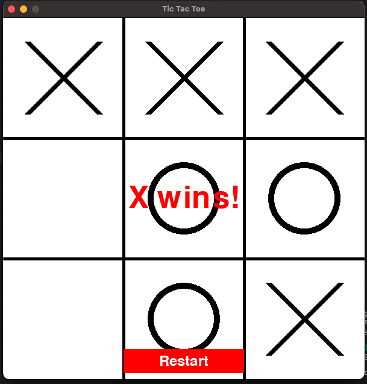

# Tic Tac Toe - Pygame Edition - generated by GPT4 

This repository contains a simple implementation of the classic Tic Tac Toe game using the Pygame library. The game features a graphical user interface and supports two players taking turns to mark their symbol ("X" or "O") on a 3x3 grid. The goal is to get three symbols in a row, either horizontally, vertically, or diagonally.



## Requirements

- Python 3.6 or later
- Pygame 2.0.0 or later

## Installation

1. Clone this repository or download the source code as a ZIP file and extract it.
2. Install the required Python packages using pip:

    ```
    pip install -r requirements.txt
    ```

## Running the Game

To start the game, run the following command:

    ```
    python main.py
    ```

A window with the game board will appear. Two players can now play Tic Tac Toe by taking turns clicking on the cells to place their symbols.

## Game Instructions

For detailed gameplay instructions, refer to the [instructions leaflet](INSTRUCTIONS.md).

## Tests

Unit tests are provided for the `Board`, `Button`, and `Game` classes. To run the tests, use the following command:

    ```
    pytest
    ```

## Contributing

Contributions are welcome! If you have any suggestions, bug reports, or feature requests, please feel free to open an issue or submit a pull request.

## License

This project is licensed under the MIT License. See the [LICENSE](LICENSE) file for details.
